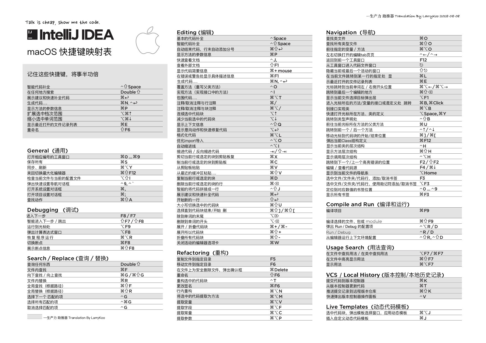

# IntelliJIDEA_ReferenceCard_CN

## IntelliJIDEA_ReferenceCard KeyMap 中英文翻译对照表

> 更新时间：2018-11-02

简书介绍：<https://www.jianshu.com/p/3aee70e83c32>

为了方便学习是更加高效的使用 IDEA 的快捷键，在网上找了一圈都没有找到IntelliJIDEA_ReferenceCard 的中英文对照表，主要是中文，毕竟想打印出来贴着熟悉，所以需要更加友好的中文对照表；可惜没有找到，说干就干，花费了一个午饭的时间，从IntelliJIDEA的官方页面下载了最新版本的 KeyMap 对照表，PDF 版本的，准备自己翻译一版本；于是有了下面的这个东东……

---

## 贡献

1. [LarryKoo](https://github.com/gumutianqi)
2. [fuzhaohao](https://github.com/fuzhaohao)
